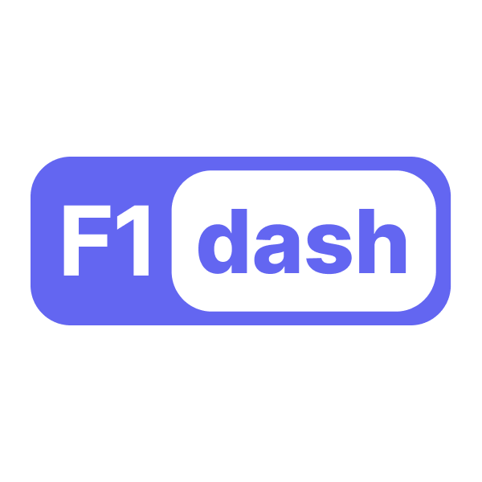

  <picture>
    <source media="(prefers-color-scheme: dark)" srcset="./dash/public/tag-logo.png" width="200">
    
  </picture>

<h1 align="center">Real-time Formula 1 telemetry and timing</h1>

## f1-dash

A real-time F1 dashboard that shows the leader board, tires, gaps, laps, mini sectors and much more.

## Contributing

I really appreciate your interest in contributing to this project. I recommend checking out the GitHub issues marked as "Good First Issue" to get started. Also, please read [`CONTRIBUTING.md`](CONTRIBUTING.md) to learn how to contribute and set up f1-dash on your local machine for development.

## Supporting

If you'd like to support this project and help me dedicate more time to it, you can [buy me a coffee](https://www.buymeacoffee.com/slowlydev).

## Notice

This project/website is unofficial and is not associated in any way with the Formula 1 companies. F1, FORMULA ONE, FORMULA 1, FIA FORMULA ONE WORLD CHAMPIONSHIP, GRAND PRIX and related marks are trade marks of Formula One Licensing B.V.